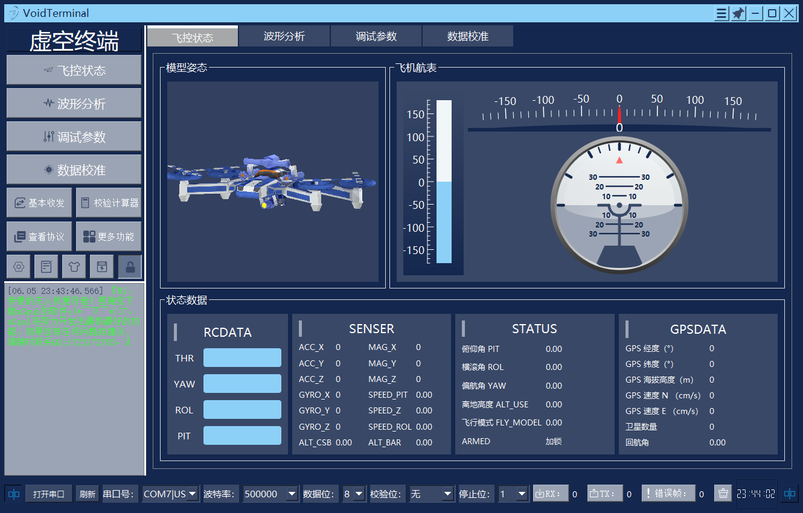

# 虚空终端——飞行器地面站


## 一、项目背景

​		大三时，广工信工院要求的项目就是要开发一套无人机课设，其中分工3的任务就是要设计一个无人机地面站软件，主要就是实现飞控的各项传感器数据的可视化，飞行姿态模型展示，无人机PID的收发以及串口的基本收发。

​		这个项目耗时接近1个月，因为大三上的辅修是c++面向对象程序开发，所以选择c++所支持的比较热门的桌面应用开发框架--Qt进行设计。该程序其实是借鉴了[无名开源地面站](https://github.com/wustyuyi/NGroundStation)的源码，通过对源码的解读进行更进一步的开发，最后顺利完成了这项课程设计。在学习途中，我深知其中的辛苦，为了造福师弟师妹们，本人决定将该项目开源，提倡大家对这个地面站进行修改和完善。

## 二、项目版本

* v 1.0.0

## 三、项目介绍

### 3.1 软件界面



### 3.2 开发环境

​		虚空终端地面站采用Qt框架进行开发，使用C++语言，编译环境是mingw73_32，Qt版本5.13。

### 3.3 使用插件

* 本项目使用到知名第三方组件包 qwt-6.1.3-插件，quc-插件来实现曲线绘制和飞行航表显示。

* 在数据导出功能上使用到QtXlsxWriter-插件。
* 上位机的模型显示使用的是Qt封装的qopengl库。

### 3.4 功能展示

* 支持QLabel标签可视化显示无人机飞控板上传感器的多项数据。
* 支持精美飞机航表直观显示飞机的飞行姿态。
* 支持[3D无人机模型](https://www.3dcool.net/)对无人机的姿态进行实时表现。
* 支持无人机模型多种皮肤切换。
* 支持一次性打开多个串口助手进行自由通信，借助NRF模块可以实现多对多通信。
* 支持曲线绘制分析无人机传感器数据，以及数据的excel导出，曲线可个性化修改（曲线选择性显示，宽度，颜色，是否填充）
* 支持飞控板上PID的读取，写入和保存，其中Check帧的检验可自定义
* 支持串口收发数据的显示（数据本身，数据字节数量，错误帧），这将能帮助你对飞控板的协议数据进行调试
* 支持对飞控板发送各项校准命令以及模块读取命令，实现飞机的稳定飞行

## 四、安装使用

### 4.1 基本运行

* 下载安装qt5.13并配置好环境，推荐从这里下载qt5.13 https://download.qt.io/archive/qt/5.13/5.13.0/，安装过程中编译器勾选mingw32。
* 将qwt，quc，QtXlsxWriter动态链接库的路径导入项目文件.pro，这里提供前两个插件的[教程](doc/quc和qwt插件的安装.docx) 。xlsx库的安装可自行上网搜。
* 编译构建运行。

### 4.2 插件下载

QWT6.1.3：https://qwt.sourceforge.io/

链接：https://pan.baidu.com/s/1W2UUki_e73pQ7X-7qgs5Fw 提取码：x1aj

QUC自定义控件：http://www.qtcontrol.cn/

链接：https://pan.baidu.com/s/1s9gpVaawuqrKXAXMFsIvWQ 提取码：dyxq

### 4.3 协议更改

* 应老师的要求，本软件是基于[ANO_TC匿名科创地面站]([welcome [匿名科创\] (anotc.com)](http://anotc.com/wiki/welcome))的协议进行通信的，如需更改协议，请跳转至源文件的**serialthread.cpp**中，该类独立于一个子线程，拥有一个串口指针成员，主要用于管理主串口的数据收发，解析处理，分类等。

* 数据解析函数，该函数便是对串口的数据进行协议解析，大家根据自己的协议进行更改即可。

  ```cpp
  //数据解析函数,每次接受8位数据，进行通信协议的解析
  void SerialThread::dataParse(uint8_t data)
  {
      static uint8_t RxBuffer[BufferSizeMax];//用于暂存每一帧数据
      static uint8_t _data_len = 0,_data_cnt = 0;//用于记录数据长度
      static uint8_t state = 0;//状态机
      if(state==0&&data==ANO_HEAD1)//帧头1
      {
          state=1;
          RxBuffer[0]=data;
          //   qDebug()<<"帧头1"<<endl;
      }
      else if(state==1&&data==ANO_HEAD2)//帧头2
      {
          state=2;
          RxBuffer[1]=data;
          //  qDebug()<<"帧头2"<<endl;
      }
      else if(state==2&&data<0XFA)//功能字
      {
          state=3;
          RxBuffer[2]=data;
          //     qDebug()<<"功能字"<<endl;
      }
      else if(state==3&&data<0x64)//数据长度<64字节
      {
          state = 4;
          RxBuffer[3]=data;
          //记录数据长度
          _data_len = data;
          _data_cnt = 0;
          //  qDebug()<<"总数据长度"<<_data_len<<endl;
      }
      else if(state==4&&_data_len>0)//数据区
      {
          //长度-1，直到0把数据全部放到RxBuffer
          _data_len--;
          // qDebug()<<"剩余数据长度"<<_data_len<<"data为"<<data<<"data_cnt为"<<_data_cnt<<endl;
          RxBuffer[4+_data_cnt++]=data;
          if(_data_len==0)
              state = 5;
      }
      else if(state==5)//校验和
      {
          RxBuffer[4+_data_cnt]=data;
          //  qDebug()<<"校验和"<<endl;
          //  qDebug()<<"传送至数据分类"<<endl;
          dataSort(RxBuffer,_data_cnt+4);//将检验完的数据发送到分类函数根据功能号分类
          state = 0;
      }
      else
      {
          state = 0;
          //  qDebug()<<"default1"<<endl;
      }
  }
  ```

* 数据分类函数，由于协议数据太多，代码有点长，所以不展示了。主要就是将数据进行校验和检验，如果通过检验便能够进一步分类数据，将数据保存在全局变量里，这样其他的窗口类就能够接收到这个变量并进行显示操作了。

  ```cpp
  //将数据根据功能区分类
  void SerialThread::dataSort(uint8_t *rxBuffer,uint8_t lastIndex)
  ```

* 全局变量头文件，该头文件里保存了协议中上位机要接收的所有数据，都通过全局变量进行保存了，大家可以根据自己的协议中所需要的数据进行删改。

  ```cpp
  #ifndef HEADPARAMETER_H
  #define HEADPARAMETER_H
  //该头文件主要用于声明各种变量，并extern出去
  #include <QString>
  #include <QVector>
  
  //传感器数据
  extern float ROL,PIT,YAW;
  extern float ALT_USE;
  extern uint8_t FLY_MODEL,ARMED_FLAG;
  extern int16_t ACC_X,ACC_Y,ACC_Z,GYRO_X,GYRO_Y,GYRO_Z,MAG_X,MAG_Y,MAG_Z;
  //遥控器数据
  extern uint16_t CH_THR,CH_YAW,CH_ROL,CH_PIT,CH_AUX1,CH_AUX2,CH_AUX3,CH_AUX4,CH_AUX5,CH_AUX6;
  //gps定位数据
  //...
  
  //电压和电流数据
  extern float VOTAGE,CURRENT;
  //马达数据
  extern uint16_t PWM_MOTO[8];
  //超声波数据
  extern float ALT_BAR,ALT_CSB;
  //参数序号，飞机自动定高
  extern uint16_t PARAMETER;
  extern float VALUE;
  ...
  ```

### 4.4 UI修改

* 本程序中大多数ui控件都是基于qtDesigner设计的，如果想要更改ui请直接打开.ui 文件进行设计。需要注意的就是我把openglWidget和qtabWdiget进行了提升，也就是说，这两个组件实际上是自定义的组件，他们分别对应GLWidget类和MyTabWidget类。如果你是小白的话请注意，如果你删除了部分组件，那么在代码中也要做出相应的删改，主要就是删`ui->btn_xxx`这些。

## 五、版权说明

* 作者：xGgui

* 邮箱：1723172785@qq.com

* 联系：
  * qq:1723172785    
  * vx:thedragonjiang666

* 该项目签署了MIT 授权许可，详情请参阅 [LICENSE.txt](

## 六、鸣谢

*  [匿名科创](http://anotc.com/wiki/welcome)
* [无名开源地面站](https://github.com/wustyuyi/NGroundStation)